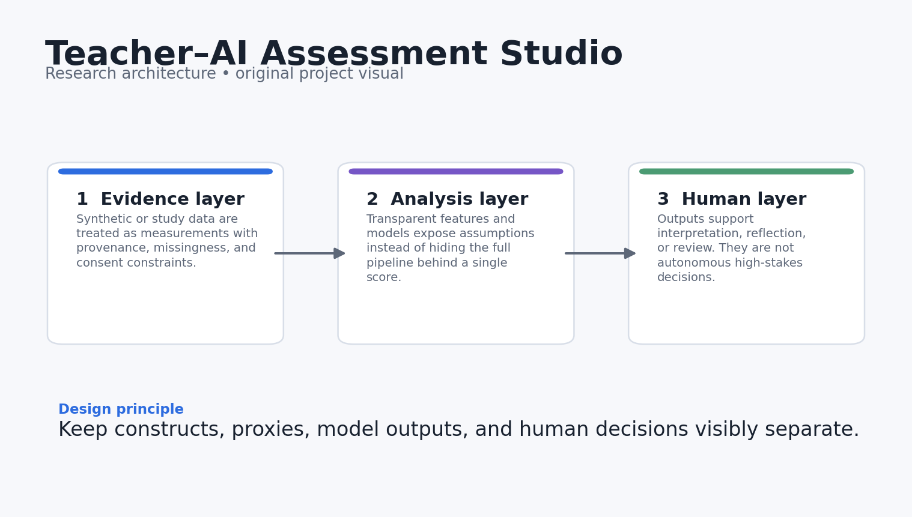
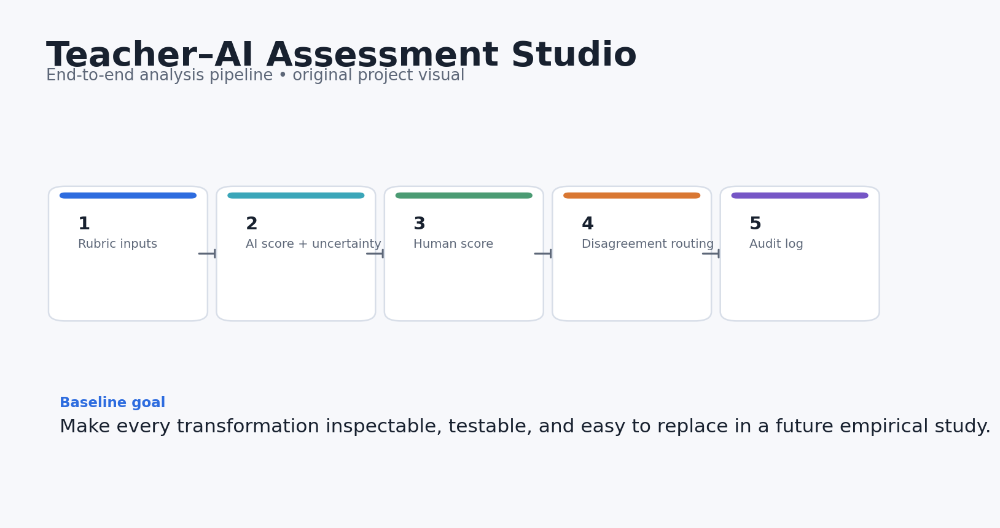
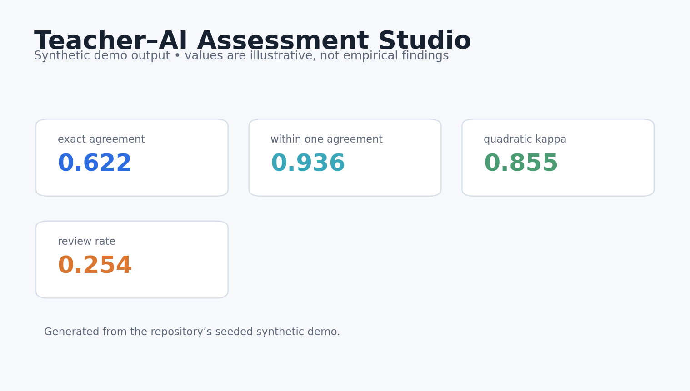
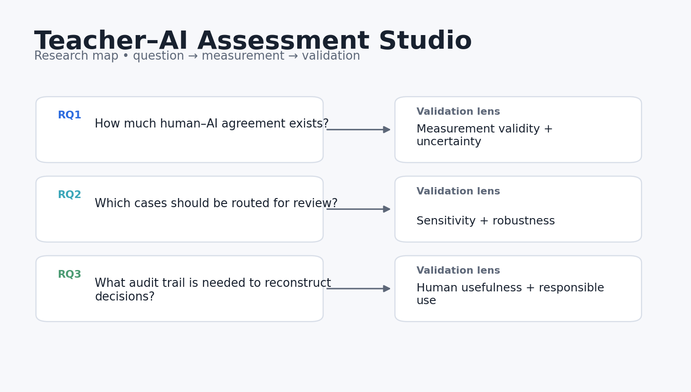

# Teacher–AI Assessment Studio

[](https://github.com/devissaputra/teacher_ai_assessment/actions/workflows/ci.yml)


**Category:** AI in Education
**Human-in-the-loop rubric scoring with disagreement routing, uncertainty, and auditable decisions.**

> Research prototype. All bundled data and results are synthetic demonstrations. Nothing in this repository should be interpreted as evidence about real learners, teachers, or institutions.



## Why this project exists

Automated assessment becomes risky when a clean score hides disagreement and uncertainty. This project makes those tensions visible. It treats AI scoring as decision support and routes ambiguous cases to human review instead of pretending automation is infallible.

The project separates AI scoring, teacher scoring, disagreement detection, uncertainty, and final resolution so no single score is treated as ground truth. That structure makes it possible to study where automation helps, where human review is needed, and how decisions can remain auditable.

## Research questions

1. How much agreement exists between human and AI rubric scores?
2. Which combination of model uncertainty and score disagreement should trigger review?
3. What audit information is needed to reconstruct a final decision?

## What the repository does



The reference pipeline follows five stages:

1. **Rubric inputs**
2. **AI score + uncertainty**
3. **Human score**
4. **Disagreement routing**
5. **Audit log**

The baseline stays deliberately small so rubric logic and routing decisions can be inspected before testing with authentic assessment data.

## Core outputs

- `exact_agreement`
- `within_one_agreement`
- `quadratic_kappa`
- `review_rate`
- `resolved_disagreement`



The dashboard above is generated from **synthetic data** and is included only to show what the analysis surface looks like. It is not a reported empirical result.

## Quick start

```bash
python -m venv .venv
source .venv/bin/activate  # Windows: .venv\Scripts\activate
pip install -e .[dev]
python examples/demo.py
pytest -q
```

You can also use Docker:

```bash
docker build -t teacher_ai_assessment .
docker run --rm teacher_ai_assessment
```

## Repository structure

```text
teacher_ai_assessment/
├── src/teacher_ai_assessment/        # core implementation and synthetic-data generator
├── examples/demo.py        # end-to-end reproducible demo
├── tests/                  # executable unit tests
├── docs/                   # research design, data dictionary, references
│   └── images/             # original project diagrams and demo visualisations
├── results/                # synthetic demo outputs only
├── config/default.yaml
├── Dockerfile
├── Makefile
└── pyproject.toml
```

## Research design in one picture



The fuller design rationale is in [`docs/research_design.md`](docs/research_design.md), including constructs, assumptions, validation steps, and a proposed empirical extension.

## Reproducibility choices

- Synthetic generation uses a fixed random seed.
- The core metrics are implemented as small, testable functions.
- The demo writes machine-readable results into `results/`.
- CI runs the tests on every push and pull request.
- No API keys, proprietary datasets, or external model calls are required for the baseline.

## Responsible-use boundaries

- Synthetic scores do not validate rubric quality.
- A routing threshold is a governance choice and should be set with stakeholders.
- This repo is designed for low-stakes research prototyping, not automated personnel evaluation.

## Strong next experiments

- Add multi-rater models and generalizability theory.
- Compare uncertainty estimation methods and calibration curves.
- Build an annotation UI that records reviewer rationale and adjudication history.

## References

See [`docs/references.md`](docs/references.md). The references are there to locate the project in current AIED, learning-analytics, human-centered AI, and instructional-design research. They do **not** imply endorsement or affiliation.

## Citation

If you build on this research prototype, use the metadata in [`CITATION.cff`](CITATION.cff).

## License

MIT for the code in this repository. Research data from future studies should use a separate data-governance and consent process.
